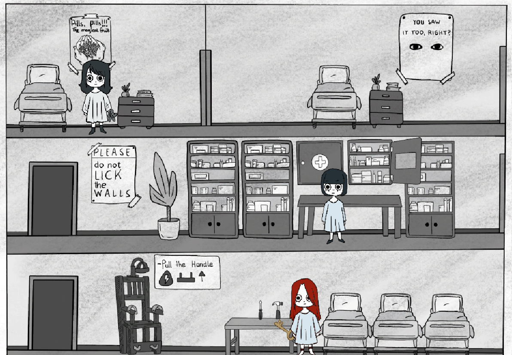
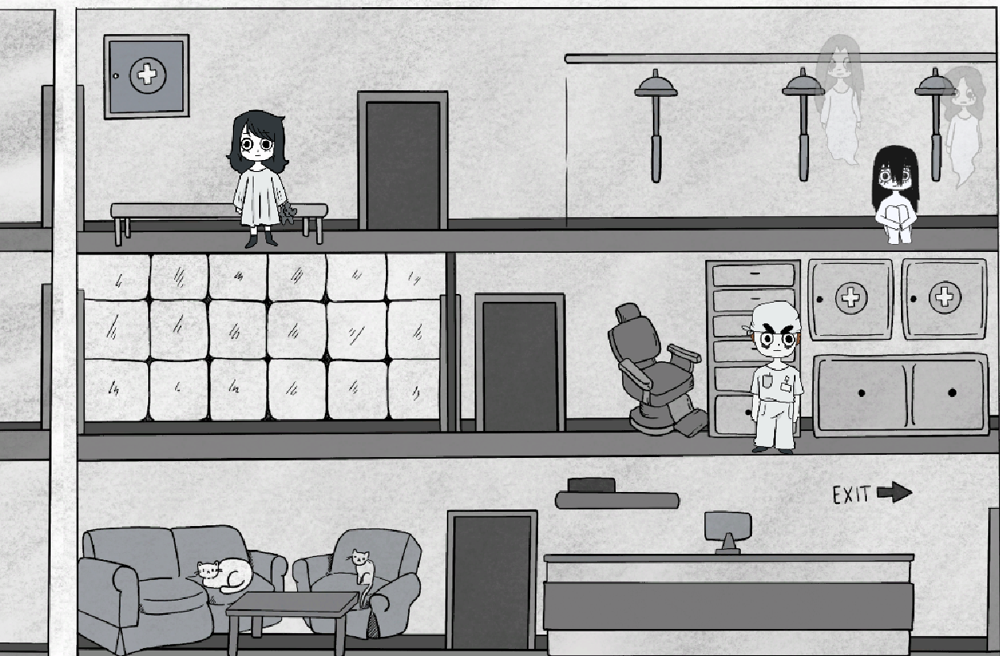

# Fractured
## A 2D side-scrolling stealth-escape game built in Unity

Fractured is a stealth-escape game loosely inspired by the true story of Rosemary Kennedy. You play as a female patient in a 1940s psychiatric ward who is trying to escape before she gets lobotomized. The building is full of staff and other patients. You have to navigate it carefully, find clues, interact with other patients, and get out.

The catch is the detection system. Nurses can notice you up to three times before you get caught. A doctor noticing you even once means immediate lobotomization, game over. The tension comes from learning the layout, figuring out who to avoid and when, and using what the other patients tell you to piece together a way out.

The current state of the repository is a demo of the intro level. In this level there is one doctor roaming the building, and one patient who holds the key to the door you need to get through. Getting that key and making it out without the doctor spotting you is the objective.

This was a university group project. The game concept and visual design were developed together with Milica Topic, who handled the artwork and assets. The coding was done by me.

> This was my first attempt at building a video game. It is a work in progress.

---

## Tech Stack

- **Engine:** Unity
- **Language:** C#
- **Graphics:** 2D, hand-drawn cartoon style in black, white, and grey

---

## How to Run

This is a Unity project, so you will need Unity installed to open and run it. The project was built with Unity 6. If you have a different version installed, Unity may prompt you to upgrade or downgrade the project on open.

**Steps:**

1. Make sure you have [Unity Hub](https://unity.com/download) installed
2. Clone the repository:
```bash
git clone https://github.com/fannibarkanyi/Fractured.git
```
3. Open Unity Hub, click "Add project from disk", and select the cloned folder
4. Open the project and let Unity import all assets
5. Once loaded, open the scene from the Assets folder and hit Play

---

## Project Context

This project was completed as part of a university game development module at SRH University of Applied Sciences Berlin. It was the first game either of us had built from scratch.

---

## Status

Work in progress. The intro/demo level is playable. Further levels and features are not yet implemented.

---

## In-Game

<div align="center">
  
  
</div>
